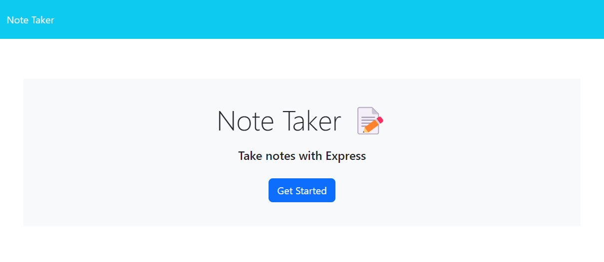
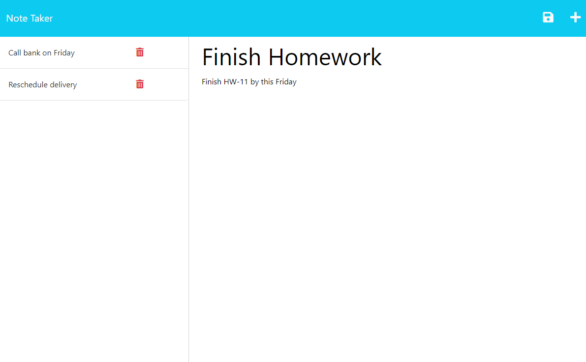

# README by Jungwoo Lee
  

## 1. Title: WEEK10_Team_Profile_Generator

## 2. Table of Contents:
This readme file includes the following contents:
+ [Description](#3-description)
+ [Installation](#4-installation)
+ [Usage](#5-usage)
+ [License](#6-license)
+ [Application results](#7-application-results)
+ [Questions](#8-questions)

## 3. Description: 
This application takes user inputs and save them into a note to manage user's notes (or schedule). A user can add/delete notes, then the application will automatically save the info in `./db/dbjson` and will show on the screen. This application uses an `Express.js` back end and saves andretrieves note data from a `JSON` file.

## 4. Installation:
Please make sure to have following programs installed on your computer to use this app:
+ VS Code
+ GitBash
+ Node.js

To generate your own README, `git clone` the repo down to your local. Then, run `npm install` in order to install the `npm` package dependencies as specified in the `./package.json` - `Express.js` and `nodemon` will be installed. Note: `nodemon` will allow you to automatically restarting the node application when file changes in the directory are detected. Now, you are ready to go!

## 5. Usage:
To use this application, follow the instruction below: 
+ Run `npm run devStart` on your terminal, 
+ then open the local host: `http://localhost:3001` on your browser - it will open `./public/index.html`. 
+ Click `Get Started` button on the browser - it will route to `localhost:3001/notes` and open `./public/notes.html`.
+ Add your notes (on `Note Title` and `Note Text` sections) and save it (click the save icon on the right corner).
+ Or delete your notes (click the delete icon on your existing notes).
+ Updated note will be saved in `./db/db.json`.

This project has the following directory structure:
+ ./Assets
  + localhost_3001.png: this application's main page
  + localhost_3001_notes.png: User note page
+ ./db
  + db.json: user note will be saved here.
+ ./helpers
  + uuid.js: automatic id generation function
+ ./old: old sources, so you can ignore this for the final product
+ ./public
  + ./assets/css/styles.css: css file for HTML files
  + ./assets/js/index.js: JavaScript file for HTML files
  + index.html: main HTML file
  + notes.html: note application HTML file
+ ./.gitignore: specifies intentionally untracked files that Git should ginore
+ ./LICENSE: MIT License 
+ ./package.json: specifics of npm's package.json handling
+ ./server.js: main server control Express Javascript file

## 6. License:
### The MIT License
  

## 7. Application results:
[GitHub:] https://github.com/jungwoo33/week11_note_taker 
View walk through video here - [Screencastify](https://drive.google.com/file/d/1Y3XqvjH1eJTEmLOYxK30jgEYNUWAE7QV/view) 
or the original video file is in `./Assets/WEEK11_Note_Taker.avi` 

## 8. Questions?:
If you have any questions, feel free to contact me via information below: 
[GitHub:] https://github.com/jungwoo33 
[Email:] jungwoo33@gmail.com

- - -
© 2023 Jungwoo Lee. Confidential and Proprietary. All Rights Reserved.